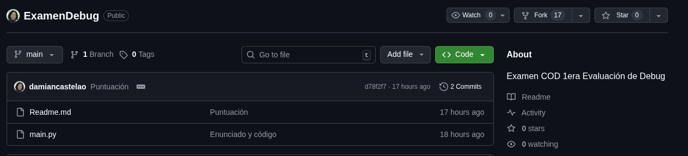
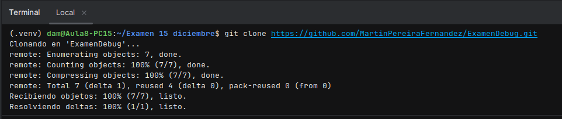
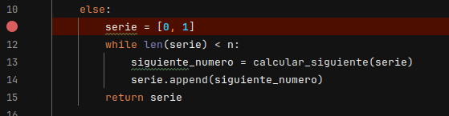
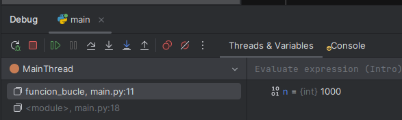
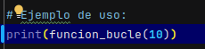
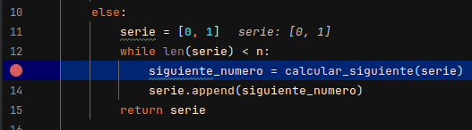
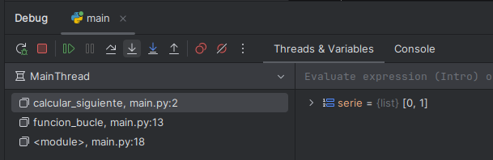
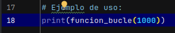
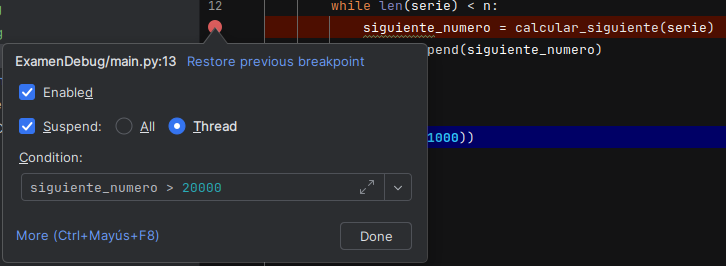

# Examen de Depuración en PyCharm

---

## **Instrucciones:**

1. Realiza un fork de este repositorio y clónalo.  
Para ello iremos al repositorio del examen y haremos un fork, lo que hará un repositorio igual al del examen pero dentro de nuestro repositorio.    
Harémos un git clone del repositorio con el cual ya podemos operar dentro de PyCharm.  

1. Las respuestas a las preguntas realízalas en este Readme
2. Cada pregunta vale un punto

### Apartado 1

- Coloca un punto de interrupción **normal** en la línea donde se inicializa la lista de la serie: `serie = [0, 1]`. 
- Inicia el modo *Debug*.  
  
  Para ello haremos click sobre la linea de codigo sobre la que queremos el debug, en este caso es la linea 11.  

**Pregunta**

1. Si la función es llamada con `n=10`, ¿cuál es el valor de la variable `n` que se visualiza en la ventana de variables del debugger justo antes de que se ejecute la línea `serie = [0, 1]`?  
El valor de n será igual a 1000. Esto se debe a que al hacer el debug pierde las condiciones de n<=0 y n == 1.

---

### Apartado 2

-  Asegúrate de que la llamada a la función es `print(funcion_bucle(10))`.  
Cambiamos el valor de la llamada a 10.  

-  Inicia el modo *Debug* y avanza hasta que la ejecución se detenga en la línea `siguiente_numero = calcular_siguiente(serie)`.  

-  Utiliza la opción de depuración adecuada para **entrar dentro** de la función `calcular_siguiente`.  

**Preguntas**

1. Justo cuando el debugger se detiene dentro de la función `calcular_siguiente` por **primera vez**, ¿cuál es el valor que tiene la variable local `aux` *después* de que se ejecute la línea `aux = serie[-1] + serie[-2]`?
**(Indica el valor numérico exacto de la variable `aux` en ese momento y el nombre de la herramienta de *debugging* que utilizaste para entrar en la función).**  
El valor justo que toma la variable aux es **1** ya que es 0+1  
La función que hay que usar es el **Step Into** 
2. Si estuvieras dentro de la función `calcular_siguiente` y quisieras salir rápidamente sin ejecutar el resto de las líneas, volviendo al punto de llamada en `funcion_bucle`, ¿qué función del debugger deberías usar?  
Para eelo debemos ejecutar la función **Step Out**.
3. ¿Qué diferencia fundamental existe entre usar *Step Over* y *Step Into* en la línea `siguiente_numero = calcular_siguiente(serie)`?  
El Step Over **no ejecuta la linea de comando** y el step Into **si que la ejecuta**

---

### Apartado 3

-  Cambia la llamada a la función para que el número de elementos sea mayor: `print(funcion_bucle(1000))`.  

-  Establece un **Breakpoint Condicional** para que la ejecución se detenga solo cuando `siguiente_numero` sea **mayor que 20000**.  

**Pregunta**

1. Cuando el *Breakpoint Condicional* se activa por **primera vez** (la primera vez que `siguiente_numero` es mayor que 20000), ¿qué longitud tiene `serie`?  
La serie obtendrá una longitud de **27** ya que unicamente hay 27 valores dentro de esta sucesión que sean menores a 20000.
---
